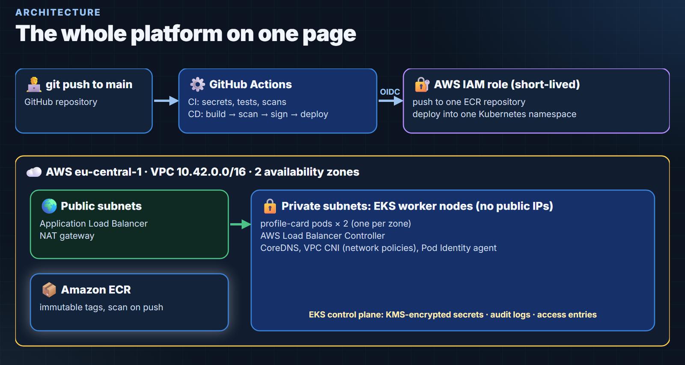

# EKS DevSecOps Platform: React on Amazon EKS with Terraform and GitHub Actions

A small React app goes from a laptop to the internet on **Amazon EKS**, the way a security-minded team would do it:
- **Terraform** builds the network, the cluster, the registry and the permissions (72 resources, one region).
- **GitHub Actions** checks every change and, on every push to `main`, builds, scans, signs and deploys the app,
  with **no AWS keys stored anywhere** (GitHub OIDC).
- The app is exposed through an **Ingress → Application Load Balancer**, from private worker nodes.
- The cluster was then **attacked**, two real weaknesses were **fixed**, and everything was **deleted and verified**.




> 📚 **New to AWS or Kubernetes? Start with the [study guide](study/README.md)** (also a single **[PDF](study/study-guide.pdf)**):
> every tool from zero, 9 hands-on labs (4 free, 5 in your own AWS account) and 25 interview questions.
>
> 🎬 **Video walkthrough:** the whole build, every tool, the attacks and the teardown, made from the real recordings
> (23 minutes): see [video/](video/README.md).
> A two-part, step-by-step **workshop** (built live on AWS: Terraform, a console tour, the pipeline, a failing security
> check, troubleshooting, and the verified teardown) is in the same folder.

**Measured on a real AWS account** (details: [docs/test-results.md](docs/test-results.md)):

| | Result |
|---|---|
| `terraform apply` | 72 resources in 12 min 30 s (plan: 0 to change, 0 to destroy) |
| `git push` → live | 3 min 37 s |
| Trivy image gate | blocked the first image (a HIGH vulnerability with a fix), then 0 |
| Privileged pod / pod egress / node credentials via IMDS | refused / blocked / blocked |
| Lateral access from another namespace | worked (HTTP 200) → fixed → blocked |
| Requests during a deployment | 3 of 280 failed → fixed → 401 of 401 |
| Teardown | 72 destroyed, verification clean, 62 minutes on AWS in total |

---

## 1. Problem statement

Getting a container running on Kubernetes is easy. Running it safely is the job: no long-lived cloud keys in CI,
no known vulnerabilities shipped, no nodes on the internet, no over-privileged pods, no downtime on deploys, and no
forgotten resources costing money.

## 2. Pain points this project addresses

- AWS access keys stored as CI secrets (a frequent breach cause) → **OIDC, short-lived credentials**.
- Base images with fixable vulnerabilities → **Trivy gate** before anything is pushed.
- Worker nodes with public IPs → **private subnets**; only the load balancer is public.
- Pods that run as root or reach node credentials → **Pod Security restricted**, **IMDSv2 hop limit 1**.
- Lateral movement between apps → **default-deny NetworkPolicy**, tested from another namespace.
- Dropped requests during rollouts → **pod readiness gates + preStop + deregistration delay**, measured.
- Forgotten lab resources → **ordered teardown + verification script**.

## 3. Objectives

1. Build the platform as code in one region (eu-central-1), touching nothing that already exists in the account.
2. Deploy on every push, with security gates and no stored cloud credentials.
3. Prove the security settings with real attacks, and prove zero-downtime deploys with real traffic.
4. Delete everything and prove it.

## 4. Architecture

```
git push ─► GitHub Actions
             ci.yaml:     gitleaks · lint/test/npm audit · hadolint + Trivy image · terraform validate + Trivy config
                          + kubeconform · pinned actions + actionlint + zizmor
             deploy.yaml: job 1 (no cloud access): build → Trivy gate → SBOM
                          job 2 (environment production): OIDC → ECR (by digest) → ECR scan → cosign sign
                                 → kubectl apply (exact digest) → least-privilege check → smoke test
AWS eu-central-1 · VPC 10.42.0.0/16 · 2 AZs
  public subnets:  internet-facing ALB, NAT gateway
  private subnets: EKS managed nodes (no public IPs) ─ profile-card pods ×2, AWS Load Balancer Controller
  EKS 1.37: KMS-encrypted secrets, audit logs, access entries, VPC CNI network policies, Pod Identity
  ECR: immutable tags, scan on push
```

Details and decisions: [docs/architecture.md](docs/architecture.md).

## 5. Technologies

| Tool | Version | Role |
|---|---|---|
| Terraform | 1.15 | infrastructure as code (AWS provider 6.67, VPC module 6.7.3, EKS module 21.26.0) |
| Amazon EKS | Kubernetes 1.37 | managed Kubernetes, 2 × t3.medium managed nodes (AL2023) |
| AWS Load Balancer Controller | 3.5.0 | Ingress → Application Load Balancer, via EKS Pod Identity |
| Amazon ECR | — | image registry, immutable tags, scan on push |
| React + Vite | 19 / 8 | the app (5 unit tests, oxlint) |
| nginx-unprivileged | 1.30-alpine | non-root static file server with strict security headers |
| GitHub Actions | — | CI and CD, actions pinned by commit SHA |
| Trivy | 0.75.0 | image, Terraform and Kubernetes scanning |
| gitleaks, hadolint, kubeconform, actionlint, zizmor | 8.30.1, 2.15.1, 0.8.0, 1.7.12, 1.30.1 | static checks |
| cosign | 3.1.3 | keyless image signing |
| Syft | 1.54.0 | SBOM |

## 6. Repository structure

```
app/              React + Vite app, Dockerfile, nginx config (security headers, /healthz)
k8s/              Kustomize: Deployment, Service, Ingress, NetworkPolicies, PDB, ServiceAccount
terraform/        VPC, EKS, ECR, IAM (GitHub OIDC role), Load Balancer Controller, namespace
scripts/          teardown.sh, verify-teardown.sh, ci/ (checksum-verified tool installer, pinned-actions check)
.github/          ci.yaml, deploy.yaml, CODEOWNERS, Dependabot
.trivyignore.yaml accepted risks, each with a reason and an expiry date
docs/             architecture, test results, runbook, troubleshooting
video/            the video, built from code (scenes, narration, redaction, YouTube package)
```

## 7. Prerequisites

- An AWS account and credentials allowed to create VPC, EKS, ECR and IAM resources (**costs roughly $0.30/hour while running**)
- Terraform ≥ 1.10, AWS CLI v2, kubectl 1.36–1.38, the GitHub CLI, a fork of this repository

## 8. Quick start

```bash
# 1. point the project at your fork (terraform/variables.tf), and read your OIDC subject prefix:
gh api repos/<you>/<fork>/actions/oidc/customization/sub
# 2. build it (about 13 minutes)
export AWS_REGION=eu-central-1
export TF_VAR_allowed_account_id=<your 12-digit account id>
terraform -chdir=terraform init && terraform -chdir=terraform apply
# 3. connect the pipeline
terraform -chdir=terraform output -raw github_deploy_role_arn | gh secret set AWS_DEPLOY_ROLE_ARN --env production
gh variable set DEPLOY_ENABLED --body true
# 4. push to main (or run the deploy workflow) and open the URL shown in the run
# 5. the same day:
scripts/teardown.sh
```

The `production` environment must exist and accept deployments from `main` only (Settings → Environments).

## 9. Configuration

| What | Where |
|---|---|
| Region (validated: eu-central-1), allowed account | `terraform/variables.tf`, `TF_VAR_allowed_account_id` |
| Repository and OIDC subject allowed to deploy | `github_repository`, `github_oidc_subject_prefix` |
| Create the GitHub OIDC provider (fresh accounts only; it is shared per account) | `create_github_oidc_provider` (default `false`: read the existing one) |
| Kubernetes version, node type | `kubernetes_version`, `node_instance_type` |
| App namespace (the only one the pipeline may change) | `app_namespace` |
| Accepted scanner findings | `.trivyignore.yaml` |
| Deploy on/off | repository variable `DEPLOY_ENABLED` |

## 10. Testing

| Layer | Where | What it proves |
|---|---|---|
| Secrets | ci → gitleaks | no keys or passwords in the full git history |
| App | ci → app | lint, 5 unit tests, `npm audit --audit-level=high`, build |
| Container | ci → container | hadolint, image builds, no fixable CRITICAL/HIGH vulnerabilities |
| Infrastructure | ci → infrastructure | Terraform fmt/validate, Trivy misconfiguration scan (Terraform + rendered manifests), kubeconform |
| Pipeline | ci → pipeline-security | actions pinned by SHA, actionlint, zizmor |
| Deployment | deploy → job 2 | ECR scan, signature verifies, rollout completes, `kubectl auth can-i` limits, smoke test via the ALB |
| Live | [docs/test-results.md](docs/test-results.md) | attacks, lateral movement, zero-downtime measurement, verified teardown |

## 11. Results

See the table at the top and [docs/test-results.md](docs/test-results.md).

## 12. Monitoring and logging

- EKS control plane logs (api, audit, authenticator) in CloudWatch, 7-day retention.
- VPC flow logs in CloudWatch, 1-minute aggregation, 7-day retention.
- The deployment's step summary links the live URL and records the commit.
- Not included (see Future improvements): metrics and alerting for the app.

## 13. Security

- **No stored cloud keys:** GitHub OIDC with a trust policy for one repository's `production` environment (immutable
  subject); the role can push to one ECR repository and describe one cluster; its EKS access entry is scoped to one
  namespace, and every deployment asserts that with `kubectl auth can-i`.
- **Cluster:** private nodes, IMDSv2 with hop limit 1, encrypted disks, KMS-encrypted secrets, audit logs, access
  entries, Pod Security `restricted` on the app namespace, network policies enforced by the VPC CNI.
- **Workload:** non-root (UID 10101), read-only root file system, all capabilities dropped, seccomp RuntimeDefault, no
  service account token, resource limits, default-deny network policy with one ingress rule from the ALB subnets.
- **Supply chain:** base images pinned by digest, actions pinned by commit SHA, tools installed by checksum, images
  deployed by digest, signed with cosign, ECR tags immutable.
- **Accepted risks** (written down, dated): public EKS API endpoint for GitHub-hosted runners, nodes' outbound access.
- **HTTP only:** without a domain there is no TLS certificate; see Future improvements.

## 14. Troubleshooting

See [docs/troubleshooting.md](docs/troubleshooting.md): every problem hit while building this, with its fix.

## 15. Failure scenarios

| Failure | What happens |
|---|---|
| A fixable CRITICAL/HIGH vulnerability | job 1 fails; nothing is pushed or deployed |
| ECR finds a CRITICAL vulnerability | job 2 stops before signing and deploying |
| New pods never become healthy | `rollout status` times out, the job fails, old pods keep serving (`maxUnavailable: 0`) |
| One availability zone fails | the other replica keeps serving (topology spread, PDB `minAvailable: 1`) |
| A node is replaced | the PDB keeps one pod; readiness gates keep the ALB on healthy pods |
| The OIDC trust does not match | `configure-aws-credentials` fails; nothing is pushed |

## 16. Operations

The **[runbook](docs/runbook.md)** covers deploys, rollbacks, scaling, rotating access, and the teardown.

## 17. Cleanup

```bash
scripts/teardown.sh           # deletes the Ingress first (the ALB is not managed by Terraform), then terraform destroy,
                              # then runs scripts/verify-teardown.sh
gh variable set DEPLOY_ENABLED --body false
```

## 18. Limitations

- HTTP only (no domain for a certificate).
- Public EKS API endpoint (GitHub-hosted runners); one NAT gateway (lab cost); local Terraform state.
- Images are signed, but the cluster does not verify signatures at admission yet.
- No autoscaling, metrics or alerting for the app.

## 19. Future improvements

- Domain + ACM certificate + HTTPS redirect; AWS WAF on the ALB.
- Private API endpoint with self-hosted runners in the VPC; one NAT gateway per AZ.
- Remote state in S3 with locking.
- Admission-time signature verification with Kyverno (see the
  [secure supply chain project](https://github.com/sufyanahmadkamboh/sufyan-devops-secure-supply-chain)).
- HPA, Karpenter, Prometheus/Grafana, alerting; version-skew-safe asset hosting (CDN or retained assets).

## 20. Learning resources

- [Amazon EKS best practices guide](https://docs.aws.amazon.com/eks/latest/best-practices/introduction.html)
- [AWS Load Balancer Controller](https://kubernetes-sigs.github.io/aws-load-balancer-controller/latest/)
- [GitHub Actions OIDC with AWS](https://docs.github.com/en/actions/security-for-github-actions/security-hardening-your-deployments/configuring-openid-connect-in-amazon-web-services)
- [Kubernetes Pod Security Standards](https://kubernetes.io/docs/concepts/security/pod-security-standards/)
- [Trivy](https://trivy.dev/)
- This project's [study guide](study/README.md) and [interview questions](study/interview-questions.md)

## 21. Skills demonstrated

- AWS networking and EKS with Terraform, guarded for shared accounts (region, account, tags, plan review)
- DevSecOps pipelines: secret, dependency, image, IaC and manifest scanning; signing; least-privilege deploys
- Keyless cloud access with OIDC and EKS Pod Identity
- Kubernetes hardening and verifying it with attacks
- Zero-downtime delivery behind an ALB, measured with real traffic
- Safe teardown and verification in a production account

---

**Author:** Sufyan Ahmad · DevOps Engineer · [Portfolio](https://sufyanahmadkamboh.github.io/) · [LinkedIn](https://linkedin.com/in/sufyanahmadkamboh) · MIT License
